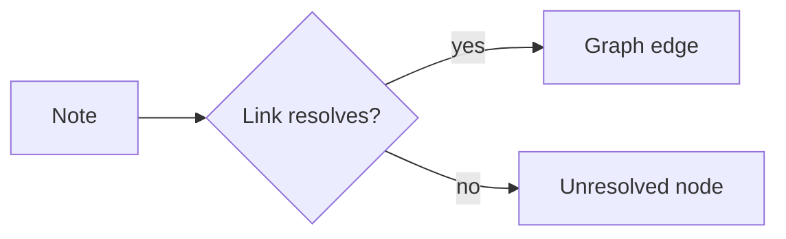
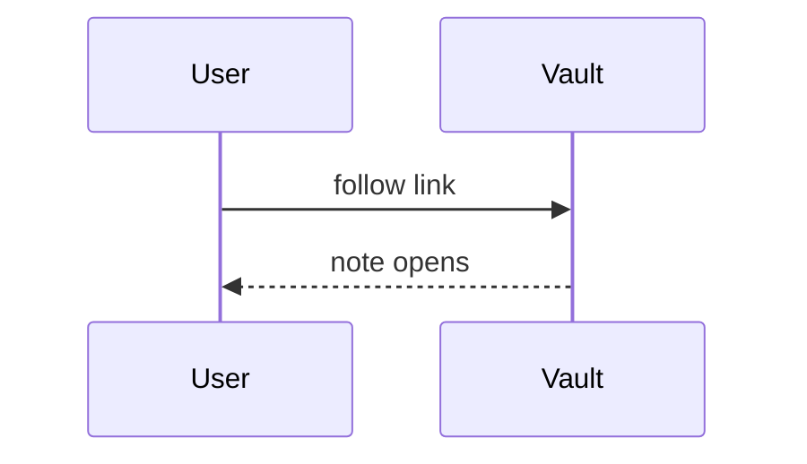
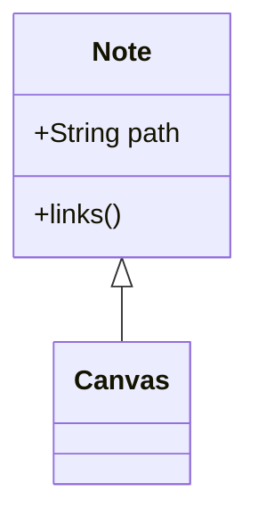

# Mermaid

```mermaid
flowchart LR
  A[Note] --> B{Link resolves?}
  B -- yes --> C[Graph edge]
  B -- no --> D[Unresolved node]
```

```mermaid
sequenceDiagram
  participant U as User
  participant V as Vault
  U->>V: follow link
  V-->>U: note opens
```

```mermaid
classDiagram
  class Note {
    +String path
    +links()
  }
  Note <|-- Canvas
```

An invalid diagram:

```mermaid
this is not a diagram
```
